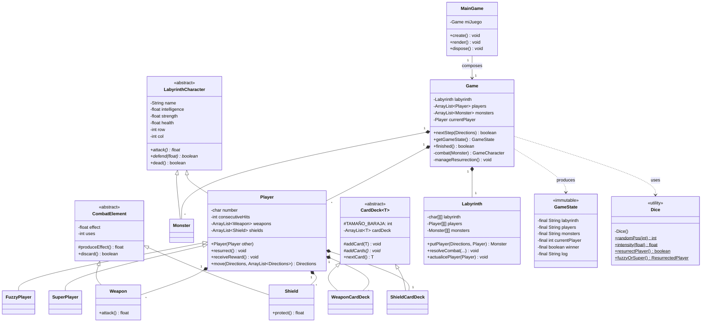

# Irgarten — Project Report

**Course:** Object-Oriented Programming (POO)
**Institution:** Instituto Superior Miguel Torga (ISMT), Coimbra
**Project:** Irgarten — a 2D labyrinth turn-based game

---

## 1. Introduction and Context

Irgarten is a turn-based 2D labyrinth game developed as the final project for the Object-Oriented Programming course. The player controls a character on a procedurally-generated grid, fights monsters in cell-by-cell encounters, picks up rewards (weapons, shields, health), and races toward an exit cell that ends the match. The defining mechanic of the project is the resurrection system: when a player dies, a random branch can rebuild them as one of two enhanced subclasses, `FuzzyPlayer` (erratic movement and stochastic combat) or `SuperPlayer` (intelligence-multiplied attack).

The game was chosen specifically as a vehicle for applying the four pillars of OOP — encapsulation, abstraction, inheritance, and polymorphism — to a problem that is non-trivial but compact enough to keep the architecture readable. A turn-based labyrinth fits this purpose well: it has a small number of clearly distinguished entities (characters, items, board), a tight feedback loop in the combat system, and natural opportunities for hierarchies (player variants, combat elements, card decks). The resurrection mechanic in particular requires the copy constructor and dynamic dispatch to work in concert, which makes it a useful capstone for the syllabus.

The project is implemented in Java with the [libGDX](https://libgdx.com/) game framework and the LWJGL3 desktop backend. It is built and run with the Gradle wrapper bundled in the repository, which removes any installation step beyond having a JDK available. The code is organized in two Gradle subprojects (`core` and `lwjgl3`) so that the game logic remains isolated from the platform-specific launcher, in line with the standard libGDX project layout.

## 2. Requirements (Functional and Non-Functional)

### 2.1 Functional Requirements

- **RF01** — The system shall generate a labyrinth of configurable difficulty (`EASY`, `NORMAL`, `HARD`), with each preset determining grid size, number of monsters, and number of wall blocks.
- **RF02** — The system shall populate the labyrinth with one or more players and a set of monsters at randomly chosen empty positions, with one exit cell also placed at random.
- **RF03** — The player shall be able to request movement in one of four directions (`UP`, `DOWN`, `LEFT`, `RIGHT`), with the move resolved against valid neighbouring cells.
- **RF04** — When a player steps onto a monster cell, the system shall trigger a turn-based combat capped at `MAX_ROUNDS` rounds.
- **RF05** — In each combat round the player attacks first and the monster defends; if the monster survives it counter-attacks and the player defends. If neither dies within the round cap, the entity with the most remaining health wins.
- **RF06** — On combat victory, the player shall receive a randomized reward (zero or more weapons, zero or more shields, and a health bonus), respecting inventory caps (max 2 weapons, max 2 shields).
- **RF07** — On combat defeat, the player shall be marked as dead and skip subsequent turns until the resurrection mechanic is invoked.
- **RF08** — When a dead player's turn arrives, the system shall coin-flip whether the player resurrects. If yes, it shall be reborn as a `FuzzyPlayer` (≈ 20% probability) or a `SuperPlayer` (≈ 80% probability), preserving identity and board position.
- **RF09** — The game shall end when any player reaches the exit cell.
- **RF10** — The system shall expose an immutable snapshot of the game state (`GameState`) that the UI consumes each frame to render the board, players, monsters, and a log of the last event.
- **RF11** — The UI shall provide screens for menu, settings, gameplay, and victory, and offer keyboard shortcuts to restart (`R`), mute music (`M`), toggle fullscreen (`F11`), and quit (`ESC`).

### 2.2 Non-Functional Requirements

- **RNF01** — The application shall run at an interactive frame rate (target 60 FPS) on standard desktop hardware, with smooth player movement obtained via linear interpolation between logical positions.
- **RNF02** — The application shall be portable across Windows, macOS, and Linux, using the Gradle wrapper to handle build and dependency resolution without prior installation.
- **RNF03** — The domain logic (`core` module) shall not depend on libGDX or any UI library, so it can be tested or reused independently from the rendering layer.
- **RNF04** — All domain attributes shall be encapsulated with the strictest viable visibility (`private` by default, `protected` only when subclasses legitimately need access); no public mutable fields.
- **RNF05** — The codebase shall favor polymorphism over runtime type inspection. The codebase contains no `instanceof` checks on domain entities; behavioral differences between `Player` variants are routed through method overriding.
- **RNF06** — Game assets (textures, sounds, music) shall be stored in an external `assets/` folder, loaded by file name at runtime so artists or designers can replace them without touching code.
- **RNF07** — The model shall expose state to the view exclusively through an immutable Data Transfer Object (`GameState`), guaranteeing that the UI cannot mutate the model accidentally.
- **RNF08** — The project shall compile cleanly (no errors, no avoidable warnings) under the Gradle build defined at the repository root.

## 3. Modeling: Use Cases and User Stories

### 3.1 Use Cases

**UC01 — Start a new game**
*Actor:* Player.
*Precondition:* Application is open in the menu screen.
*Main flow:*
1. The player selects a difficulty in the settings screen (defaults to `NORMAL`).
2. The player presses `ENTER` on the main menu.
3. The system builds a new `Game` with the chosen difficulty, generating maze, monsters, and exit.
4. The screen transitions to `PLAYING`.
*Postcondition:* A fresh game is in progress and ready to receive moves.

**UC02 — Move the player one cell**
*Actor:* Player.
*Precondition:* A game is in progress and the current player is alive.
*Main flow:*
1. The player presses an arrow key or WASD.
2. The UI calls `Game.nextStep(direction)`.
3. The game asks the current player for the effective direction (which can be perturbed if the player is a `FuzzyPlayer`).
4. The labyrinth attempts the move; if blocked, the log says so; if free, the player is repositioned.
5. The turn advances to the next player.
*Postcondition:* The board and log are updated; the turn has rotated unless the move triggered a combat or ended the game.

**UC03 — Combat against a monster**
*Actor:* Player (vs. Monster).
*Precondition:* The player moves onto a cell occupied by a monster.
*Main flow:*
1. The labyrinth marks the cell as a combat cell and returns the monster reference.
2. The game enters the combat loop (`Game.combat`), running up to `MAX_ROUNDS` rounds.
3. In each round the player attacks first; if the monster does not die, it counter-attacks.
4. The loop exits when one side dies, or by health comparison if the cap is reached.
*Postcondition:* A winner is determined; the cell is updated through `Labyrinth.resolveCombat`.

**UC04 — Receive rewards after winning**
*Actor:* Player.
*Precondition:* The combat in UC03 ended with `winner == PLAYER`.
*Main flow:*
1. The game calls `Player.receiveReward()`.
2. The player rolls the dice for weapons, shields, and health.
3. New items are added respecting inventory caps; spent items are purged first.
4. Health is increased by the rolled bonus.
*Postcondition:* The player's inventory and health reflect the reward.

**UC05 — Resurrect after dying**
*Actor:* (System; triggered when a dead player's turn arrives.)
*Precondition:* The current player has died in a previous combat.
*Main flow:*
1. `Dice.resurrectPlayer()` decides whether resurrection happens.
2. If yes, `Player.resurrect()` resets state.
3. `Dice.fuzzyOrSuper()` chooses the rebirth subclass.
4. A new `FuzzyPlayer` or `SuperPlayer` is built via the copy constructor.
5. The new instance replaces the old one in `players` and in the labyrinth.
*Postcondition:* The player is alive again as a different concrete subclass with adapted behavior.

**UC06 — Reach the exit and win**
*Actor:* Player.
*Precondition:* A game is in progress.
*Main flow:*
1. The player moves into the exit cell.
2. `Labyrinth.haveAWinner()` returns true.
3. `Game.finished()` returns true and the UI transitions to the `VICTORY` screen.
4. The screen shows the player's final health, weapons, and shields.
*Postcondition:* The match is over and the user can start a new one.

### 3.2 User Stories

- As a **player**, I want to see my current health and equipment so that I can decide whether to engage a monster or look for a safer path.
- As a **player**, I want a clear log of the last action so that I can understand why my move was blocked or what happened in combat.
- As a **player**, I want different difficulty settings so that the game stays challenging as I improve.
- As a **player**, I want my character to keep playing after dying (resurrection) so that a single bad combat does not always end the match.
- As a **developer**, I want the game logic to be independent from the rendering library so that I can change the UI or run automated tests on the domain alone.
- As a **teacher reviewing the code**, I want OOP concepts to be visible in clearly delimited classes (abstract hierarchies, generics, copy constructor, polymorphism in combat) so that the design choices are easy to audit.

## 4. Architecture: Class Diagram

The project is split into two Gradle subprojects. The `core` module holds the entire domain model plus the libGDX `ApplicationAdapter` subclass that draws it (`MainGame`). The `lwjgl3` module is a thin launcher that wires libGDX's desktop backend to `MainGame`; it contains only boilerplate (`Lwjgl3Launcher`, `StartupHelper`) and is not part of the OOP design itself.

Inside `core`, three abstract hierarchies organize the domain:

- **`LabyrinthCharacter`** is the abstract root of every entity that lives on the board. It declares `attack()` and `defend(...)` as abstract because each subclass implements them differently. `Player` and `Monster` extend it; `FuzzyPlayer` and `SuperPlayer` extend `Player` further. Two constructors are defined: a regular one and a copy constructor that is the technical foundation of the resurrection mechanic.
- **`CombatElement`** is the abstract root of objects that participate in a combat through the `effect + uses` pattern. `Weapon` and `Shield` extend it and only specialize the public name of the action (`attack()` vs. `protect()`).
- **`CardDeck<T extends CombatElement>`** is a generic abstract deck that follows the Template Method pattern: the public `nextCard()` is fixed, but `addCards()` is left abstract so each concrete deck (`WeaponCardDeck`, `ShieldCardDeck`) decides which cards to manufacture. The bound `T extends CombatElement` provides compile-time type safety.

Around those hierarchies sit a small number of standalone classes. `Dice` is a utility class (private constructor, all static) that centralizes randomness. `Labyrinth` owns the board representation as three parallel matrices (characters, players, monsters). `Game` is the orchestrator and is composed of a `Labyrinth`, a list of `Player`, and a list of `Monster`. `GameState` is an immutable snapshot that crosses the model/view boundary. `MainGame` is the libGDX `ApplicationAdapter` subclass that draws the snapshot and translates input into `Game.nextStep(...)` calls. Five enums round out the model: `Directions`, `Orientation`, `GameCharacter`, `ResurrectedPlayer`, and the nested `Game.GameDifficulty`.



**Why three abstract classes, each for a different reason.** `LabyrinthCharacter` is abstract because there is no meaningful "generic character" — every entity on the board must have a concrete attack and defense formula, so the class cannot be instantiated. `CombatElement` is abstract for the same structural reason, but the methods it shares are concrete (`produceEffect`, `discard`) — only the *semantic name* differs in subclasses (`attack()` vs. `protect()`). `CardDeck<T>` is abstract for a different reason altogether: the Template Method pattern. Its public method `nextCard()` is fully implemented; what each subclass provides is only the factory hook `addCards()`. Three different motivations for abstractness, all visible in one project.

**Polymorphism in `Game.combat()`.** The combat loop contains the single most important line of the project:
```java
boolean monsterDead = monster.defend(currentPlayer.attack());
```
At the bytecode level, `currentPlayer.attack()` is dispatched dynamically. The JVM looks at the runtime class of `currentPlayer` and executes one of three implementations: `Player.attack` (strength + sum of weapons), `FuzzyPlayer.attack` (sum of weapons + random intensity of strength), or `SuperPlayer.attack` (`super.attack() * intelligence`). `Game` is written against the abstract contract from `LabyrinthCharacter` and is completely unaware of which subclass it is talking to. Adding a new player variant would require zero changes to `Game.combat()`.

**The resurrection mechanic.** This is the project's flagship piece. When `Game.nextStep` finds that the current player is dead, it calls `manageResurrection()`. A coin flip decides whether the player comes back at all; if it does, `Player.resurrect()` resets internal state (health to maximum, inventory cleared, hit streak zeroed). Then `Dice.fuzzyOrSuper()` selects the rebirth subclass with ≈ 80% / 20% weighting. The new variant is constructed by passing the dead player to its copy constructor:
```java
currentPlayer = new FuzzyPlayer(currentPlayer); // or new SuperPlayer(currentPlayer);
```
The copy constructor in `LabyrinthCharacter` (and extended in `Player`) replicates name, attributes, position, and inventory, but the resulting object has a different runtime type. Finally, the new reference replaces the old one in `Game.players` and in the labyrinth's player matrix via `Labyrinth.actualicePlayer(...)`. From the player's perspective, the same "slot" continues playing — but their attack, defense, and movement rules have changed. This single mechanic exercises four OOP concepts at once: inheritance (subclass picks), copy constructor (state preservation), dynamic polymorphism (changed runtime behavior), and encapsulation (the swap is invisible to `Game.combat()`).

**`MainGame` composes, does not inherit, `Game`.** `MainGame` extends libGDX's `ApplicationAdapter` (an external abstract class) and holds a private `Game miJuego` field. It never extends `Game`. This is a deliberate composition-over-inheritance choice: the UI uses Game's public API (`nextStep`, `finished`, `getCurrentPlayer`, `getMonstersDebugLines`, `getLastLog`) but is free to be replaced or duplicated (e.g., a console UI) without touching the domain layer. The reverse is also true: the domain layer compiles without any libGDX import, which keeps the `core` module testable in isolation.

## 5. Conclusion and Technical Reflection

Working through Irgarten taught me that OOP principles only pay off when each one solves a concrete problem the code already has. Encapsulation made sense the moment I tried to keep `health` mutable only inside the `LabyrinthCharacter` family — exposing a setter would have allowed `Game` to bypass the combat rules entirely. Abstraction made sense once I noticed I had three different reasons to declare an abstract class (no meaningful base instance, shared mechanics with renamed actions, Template Method hook), all of them happening in the same project. Inheritance and polymorphism came together in `Game.combat()`, where the same call site runs different code depending on whether the player has resurrected as `FuzzyPlayer` or `SuperPlayer`. Writing the resurrection mechanic forced me to combine those concepts with the copy constructor, which I had previously seen only as a textbook example.

The design decisions I am most satisfied with are: the strict immutability of `GameState` (which guarantees the UI can never mutate the model), the generic deck `CardDeck<T extends CombatElement>` (a textbook use of bounded generics that doubles as a Template Method demonstration), the resurrection swap (the clearest live use of the copy constructor I have written), and the composition between `MainGame` and `Game` (which keeps the domain free of any libGDX import). The utility class `Dice` is also a clean example I want to keep: it makes randomness centralized and trivially mockable in the future.

There are a few areas I would improve given more time. First, the `CardDecks` are currently constructed inside `Player` but `receiveReward()` builds reward items directly with `new Weapon(...)`/`new Shield(...)` instead of going through `nextCard()` — the decks are dead code as far as gameplay goes, and integrating them would actually exercise the Template Method I wrote. Second, `Game.java` is around 350 lines and bundles turn management, combat resolution, and reward handling; splitting it into `CombatEngine`, `TurnManager`, and `RewardSystem` would improve cohesion without changing behavior. Third, `MainGame` handles input by polling `Gdx.input.isKeyJustPressed(...)` in `render()`; refactoring this to use libGDX's `InputAdapter` with anonymous-class or lambda listeners would showcase one more OOP idiom that is currently absent from the codebase.

Regarding the use of AI tools: I used Claude as a pair-programming assistant throughout the project. Concretely, it helped me draft the libGDX rendering scaffolding in `MainGame.java`, exhaustively translate and document every class with pedagogical comments aimed at this report and the oral defense, and refactor the auxiliary enums (`Orientation`, `GameCharacter`) out of `Weapon.java` once the compiler started warning about them. The architectural decisions (three abstract hierarchies, the resurrection swap via copy constructor, the immutable `GameState`, the composition of `MainGame` with `Game`) and all the gameplay rules are mine; the assistant accelerated the boilerplate and helped me articulate the OOP reasoning behind each decision in writing. I mention this openly because the course explicitly allows it and because I think being honest about the workflow is more valuable than pretending otherwise.
